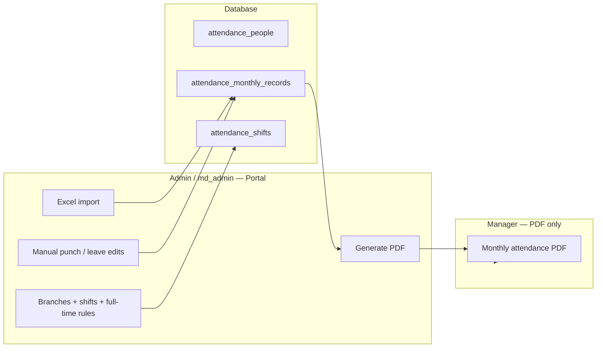

# Attendance System Audit

**Date:** July 2026  
**Audience:** MD Group internal (admins who prepare reports; managers who receive PDFs)  
**Primary manager deliverable:** Monthly attendance PDF (`/api/attendance/export.pdf`)

---

## Executive summary

The attendance system is a **monthly biometric import and reporting tool**. It is not a payroll engine — managers receive a PDF, review punch times and calculated metrics, and decide deductions themselves.

The portal is used mainly by **md_admin** and internal staff to import Excel files, configure branches/shifts, and export reports. **Managers typically only see the PDF** sent to them.

The system is architecturally sound for this purpose. The main improvement areas are: **PDF clarity and completeness**, **calculation accuracy** (especially full-time late time, recently fixed), **import/data quality before export**, and **consistency between what admins configure and what appears in the PDF**.

---

## How the system works (high level)

### Data flow

1. **Import** — Excel file (per-day summary or raw punch log) is uploaded per company / branch / month.
2. **Calculate** — Punch sessions are matched to branch shifts; late, early leave, overtime, shift type, and totals are computed and stored.
3. **Store** — One import per `(company, branch, month)`; daily rows per employee in `attendance_monthly_records`.
4. **Export** — PDF is built from stored records via `lib/attendance/attendance-pdf.ts`.

### Key files

| Area | Path |
|------|------|
| PDF report | `lib/attendance/attendance-pdf.ts` |
| PDF API | `app/api/attendance/export.pdf/route.ts` |
| Excel export (admin) | `lib/attendance/monthly-export.ts` |
| Calculations | `lib/attendance/shift-matching.ts`, `lib/attendance/monthly-calculations.ts` |
| Month aggregations | `lib/attendance/attendance-view.ts` |
| Import pipeline | `lib/attendance/import-process.ts`, `app/portal/attendance/actions.ts` |
| Branch / shift config | `app/portal/attendance/branches/` |

---

## What the manager sees: PDF structure

Each PDF contains three layers of information.

### 1. Report header

- Company name, branch name, month (Arabic)
- Print date

### 2. Branch summary table (all employees)

Per employee, one row with month totals:

| Column | Meaning |
|--------|---------|
| الموظف / # | Name and employee number |
| دوام كامل | Days classified as full-time (≥ 9h worked) |
| غياب | Absent days |
| بصمة واحدة | Days with incomplete punch (single or mismatched) |
| إجازات | Leave days |
| تأخير | Days with any late minutes |
| خروج مبكر | Days with early leave |
| إضافي | Days with overtime |
| ساعات العمل | Total worked hours |
| المطلوب | Total expected hours |
| الخصم | Total deduction hours (formula-based) |

This table is the manager’s **at-a-glance view** for the whole branch.

### 3. Per-employee detail sections

For each employee:

**Header stats** — Same month totals as the summary row (دوام كامل, غياب, تأخير, خروج مبكر, ساعات العمل, الخصم, etc.)

**Daily table** — One row per calendar day:

| Column | Meaning |
|--------|---------|
| التاريخ / اليوم | Date and weekday |
| دخول / خروج | First check-in, last check-out |
| الإجمالي | Total worked time that day |
| الدوام | Shift type (صباحي, ليلية, دوام كامل, etc.) |
| تأخير | Late minutes |
| خروج مبكر | Early leave minutes |
| ملاحظات | Leave type, absence, incomplete punch, etc. |

Days with no record appear as **empty rows** (no explicit “no data” label).

---

## What is calculated (relevant to the PDF)

Calculations run at **import** and on **manual edits** in the portal. The PDF reads stored values — it does not recalculate.

| Metric | How it is derived |
|--------|-------------------|
| **Shift type** | Nearest branch shift start time, or full-time if session ≥ 9 hours |
| **Late minutes** | First punch vs shift start minus grace (15 min default); now applied on full-time days too |
| **Early leave** | Checkout before expected end (partial shifts); full-time days currently show 0 early leave |
| **Overtime** | Worked time above expected; informational |
| **دوام كامل day count** | Days where `shift_type === "دوام كامل"` |
| **Absent days** | Explicit absence + **every roster day with no punch record** |
| **بصمة واحدة** | Single punch, identical in/out, or mismatched punch pair |

Branch **shift definitions** and **full-time thresholds** (9h to classify, 14h expected) directly affect PDF numbers. Misconfigured branches produce misleading PDFs even when import data is correct.

---

## Strengths (for the PDF workflow)

1. **Single deliverable** — One PDF per branch per month with summary + per-employee daily detail. Managers do not need portal access.
2. **Rich daily detail** — Punch times, shift label, late/early minutes, and notes (leave, absence, incomplete punch) support manager judgment.
3. **Shift-aware math** — Late time respects branch shift start and grace period; full-time classification uses configurable 9h / 14h rules.
4. **Arabic layout** — RTL, Cairo font, A4 portrait; suitable for printing and sharing.
5. **Consistent summary metrics** — Branch table and per-employee headers use the same aggregations (`buildBranchPayrollSummary` in `attendance-view.ts`).
6. **Recent fixes** — md_admin can export PDF without company-picker redirect; per-employee stats use دوام كامل / خروج مبكر instead of حضور / عطلة; full-time days now calculate late time from first punch.

---

## Issues that affect the PDF (manager-facing)

### High impact

| Issue | Effect on PDF |
|-------|----------------|
| **Reimport overwrites all data** | Admin reimports Excel → manual portal edits are lost → PDF reflects file only, not corrections |
| **Roster inflates absences** | Active employees with missing punch days show as **غياب** in summary — can look like mass absence if import is incomplete |
| **Empty days have no label** | Per-employee table shows blank rows for days without records; manager cannot tell “no work” vs “missing from file” |
| **Full-time early leave always 0** | Long day classified as دوام كامل does not show early leave minutes even if employee left before 14h; shortfall appears only in الخصم hours |

### Medium impact

| Issue | Effect on PDF |
|-------|----------------|
| **Summary table is wide** | Many columns on A4; may be hard to read on phone or when printed small |
| **Label inconsistency** | Summary header says `دوام كامل` / `خروج مبكر`; employee header says `عدد ايام الخروج المبكر` for early leave days |
| **No expected time per day** | Daily table shows total worked but not “required hours” for that day — manager must infer from shift type |
| **PDF vs Excel differ** | Excel per-employee sheets include a month footer with day counts; PDF daily section has no equivalent footer |
| **Stale data until re-export** | PDF is generated at download time from DB; if admin fixes a record, manager needs a **new PDF** |

### Low impact (admin / ops)

| Issue | Notes |
|-------|-------|
| Legacy `attendance` table | Old daily table still exists; not used for PDF but may confuse dashboard counts |
| Default month = previous month | Export defaults to last calendar month — admin must confirm month before sending |
| Delete import = super-admin only | Bad import requires super admin to remove |

---

## Admin workflow (what happens before the manager gets the PDF)

Only admins use the portal. Typical steps:

1. Select company, branch, month
2. Import Excel (or reimport if file updated)
3. Review calendar / person views for obvious errors
4. Manually fix punches, mark leave (`عطلة`, إجازة, etc.), or absence
5. Download PDF and send to branch manager

**Pain points for admins (indirectly affect PDF quality):**

- Cannot mark leave before first import for that month
- Reimport preview warns about changed punches but **still replaces entire month**; manual override flag may not surface correctly in preview (stored in `raw_payload`, queried as column)
- Two person views in portal (`?personId` vs `/person`) — same data, different screens; irrelevant to manager if they only get PDF

---

## Recommendations

Prioritized for: **accurate, clear PDF for managers** — not portal UX or deduction policy changes.

### Tier 1 — PDF quality (manager-visible)

1. **Label empty days in per-employee table** — Show `—` or `لا سجل` instead of blank cells so managers distinguish missing data from non-working days.
2. **Align summary column labels with employee headers** — Use the same Arabic labels everywhere (e.g. `عدد ايام الدوام الكامل`, `عدد ايام الخروج المبكر`).
3. **Add per-employee month footer in PDF** — Mirror Excel footer: absent days, late days, full-time days, early-leave days, total deduction hours — so managers do not need to scroll back to the summary table.
4. **Optional cover note on PDF** — One line under the title: company / branch / month / “تقرير للمراجعة” so context is obvious when forwarded on WhatsApp or email.

### Tier 2 — Data accuracy (feeds the PDF)

5. **Protect manual edits on reimport** — Skip or merge rows flagged as manually edited so admin corrections survive reimport and appear correctly in the next PDF.
6. **Soften absence counting** — Option per branch: only count explicit `غياب` in summary, not “no record” days — reduces false absence spikes in PDF summary.
7. **Friday / holiday defaults** — Optional auto-mark `عطلة` for Fridays (or branch holidays) so PDF does not show false absences.
8. **Full-time early leave in daily rows** — Consider showing shortfall or early-leave logic for دوام كامل days if managers need to see why الخصم hours differ from تأخير minutes.

### Tier 3 — Operations and maintainability

9. **Pre-export checklist for admins** — Confirm month, branch, import date, employee count vs file before sending PDF.
10. **Consolidate PDF/Excel shared logic** — Single source for grouping, day names, and footer stats to keep PDF and Excel aligned over time.
11. **Document branch setup** — Shifts and full-time thresholds must match real branch rules; document in admin UI or internal guide so PDF numbers match manager expectations.

---

## What not to change (per product direction)

- **Deduction formula and labels** — Keep الخصم as calculated reference; managers decide actual pay cuts outside the system.
- **No employee portal access** — Managers stay on PDF only; no need to simplify full portal UI for them.
- **No payroll integration** — System remains informational; avoid “finalize” or lock workflows unless business asks later.

---

## Verification checklist (before sending PDF to manager)

- [ ] Correct company, branch, and month selected
- [ ] Import completed for that month (export returns 404 without import)
- [ ] Shift definitions match branch reality (start times, grace minutes)
- [ ] Spot-check 2–3 employees: daily punches match source Excel
- [ ] Summary دوام كامل / تأخير / خروج مبكر counts match employee detail headers
- [ ] Reimport not run after manual fixes (or fixes re-applied after reimport)
- [ ] PDF opens correctly on mobile (managers often view on phone)

---

## Overall assessment

| Area | Rating | Comment |
|------|--------|---------|
| PDF as manager deliverable | **B+** | Complete summary + daily detail; some clarity gaps on empty days and labels |
| Calculation accuracy | **B+** | Shift-aware; full-time late fixed; full-time early leave still limited |
| Import → PDF pipeline | **B** | Reliable when configured; reimport and absence rules can distort PDF |
| Fit for “manager decides” model | **A−** | PDF-centric workflow matches product; system does not force payment decisions |
| Admin / ops burden | **B−** | Requires correct branch config and careful reimport discipline |

---

## Related code and tests

- PDF builder tests: `lib/attendance/attendance-pdf.test.ts`
- Shift / full-time late tests: `lib/attendance/shift-matching.test.ts`
- Month stats tests: `lib/attendance/attendance-view.test.ts`
- Calculation tests: `lib/attendance/monthly-calculations.test.ts`

---

*This document reflects the codebase as of July 2026. Update when PDF layout or calculation rules change.*
