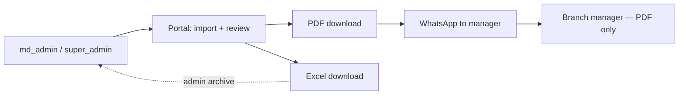

# PDF & Excel Export Consistency Plan

**Date:** July 2026  
**Workflow:** md_admin / super_admin prepare reports in the portal → download PDF (primary) and optionally Excel → send PDF to branch managers via WhatsApp. Managers do **not** use the portal.

**Goal:** One source of truth for report data, labels, and structure — rendered as PDF and Excel with identical numbers.

---

## Workflow



---

## Current inconsistencies (confirmed in code)

### 1. Different data sources for month totals

| | PDF | Excel |
|---|-----|-------|
| Branch summary | `buildBranchPayrollSummary(records, people)` — roster-aware | **No branch summary sheet** |
| Per-employee footer | Header stats from payroll summary | **Separate inline counters** in `monthly-export.ts` |

Excel footer counts `is_absent` only on days **with a record**. PDF summary counts **every roster day without a record as absent**. The same employee can show different غياب counts between PDF and Excel.

**Files:** `lib/attendance/attendance-pdf.ts`, `lib/attendance/monthly-export.ts` (lines 119–176), `lib/attendance/attendance-view.ts`

### 2. Different daily table columns

| Column | PDF | Excel |
|--------|-----|-------|
| Punch labels | دخول / خروج (short) | أول تسجيل دخول / أخر تسجيل خروج |
| الساعات المطلوبة | Missing | Present |
| زيادة / نقص | Missing | Present |
| ساعات الخصم (per day) | Missing | Present |

### 3. Different month-summary metrics

**PDF** (branch table + employee header): دوام كامل, غياب, بصمة واحدة, إجازات, تأخير, خروج مبكر, إضافي, ساعات العمل, المطلوب, الخصم.

**Excel** per-employee footer: غياب, تأخير, دوام كامل, خروج مبكر, زيادة — **missing بصمة واحدة and إجازات**.

### 4. Label inconsistency within PDF

- Summary table: `دوام كامل`, `خروج مبكر` (short)
- Employee header: `عدد ايام الخروج المبكر` (long)
- Excel footer: `عدد ايام الدوام الكامل`, `عدد ايام الخروج المبكر` (long)

### 5. Employee inclusion differs

- PDF fetches `people` roster → summary includes all roster members (`app/api/attendance/export.pdf/route.ts`)
- Excel only creates sheets for employees with records; does not fetch `people` (`app/api/attendance/export.xlsx/route.ts`)

### 6. Duplicated code

`AR_DAYS`, `dayNameAr`, `groupRecords`, `timeOrEmpty`, and similar file-naming logic are copied in both `attendance-pdf.ts` and `monthly-export.ts`.

---

## Target architecture: one report model, two renderers

### New shared module

**File:** `lib/attendance/attendance-report.ts`

```ts
export type AttendanceReportPayload = {
  meta: {
    companyName: string;
    branchName: string;
    monthLabel: string;
    printDate: string;
  };
  summary: {
    rows: PersonPayrollSummary[];
    totals: BranchPayrollTotals;
  };
  employees: EmployeeReportSection[];
};

export type EmployeeReportSection = {
  externalEmployeeNumber: string;
  employeeName: string;
  payroll: PersonPayrollSummary; // from buildBranchPayrollSummary — single source
  days: DailyReportRow[];        // one row per calendar day
};

export type DailyReportRow = {
  date: string;
  weekday: string;
  record: AttendanceMonthlyRecord | null;
  // pre-formatted display fields for PDF + Excel
};
```

**Single builder:**

```ts
buildAttendanceReport({ companyName, branch, month, records, people })
  → AttendanceReportPayload
```

Uses `buildBranchPayrollSummary` from `attendance-view.ts` as the **only** source for month totals. Both exports read from this payload — no second counting loop in Excel.

---

## Canonical Arabic labels (define once)

| Key | Label |
|-----|-------|
| fullTimeDays | عدد ايام الدوام الكامل |
| absentDays | غياب |
| onePunchDays | بصمة واحدة |
| leaveDays | إجازات |
| lateDays | أيام التأخير |
| earlyLeaveDays | عدد ايام الخروج المبكر |
| overtimeDays | أيام الزيادة |
| workedHours | ساعات العمل |
| expectedHours | الساعات المطلوبة |
| deductionHours | إجمالي الخصم |

### Daily columns (same in PDF and Excel)

| # | Label |
|---|-------|
| 1 | م |
| 2 | التاريخ |
| 3 | اليوم |
| 4 | أول تسجيل دخول |
| 5 | أخر تسجيل خروج |
| 6 | الوقت الإجمالي |
| 7 | نوع الدوام |
| 8 | الساعات المطلوبة |
| 9 | زيادة / نقص |
| 10 | دقائق التأخير |
| 11 | خروج مبكر (د) |
| 12 | ساعات الخصم |
| 13 | ملاحظات |

**Empty days:** show `—` in punch columns (not blank cells) — better for PDF on phone via WhatsApp.

---

## PDF changes (`lib/attendance/attendance-pdf.ts`)

Refactor to render from `AttendanceReportPayload` only.

1. **Branch summary** — keep table; update headers to canonical labels.
2. **Employee header** — use same labels as summary row (remove short/long mix).
3. **Daily table** — add missing columns: الساعات المطلوبة, زيادة/نقص, ساعات الخصم.
4. **Per-employee month footer** (new) — same lines as Excel footer, sourced from `payroll` row:
   - غياب, بصمة واحدة, إجازات, أيام التأخير, عدد ايام الدوام الكامل, عدد ايام الخروج المبكر, أيام الزيادة, إجمالي الخصم
5. **Layout** — keep A4 portrait; test readability on mobile after adding columns. Consider slightly smaller font for daily table only if needed.

---

## Excel changes (`lib/attendance/monthly-export.ts`)

Refactor to render from `AttendanceReportPayload` only.

1. **Add first sheet: ملخص الفرع** — same columns as PDF branch summary + totals row.
2. **Per-employee sheets** — daily columns match PDF exactly (canonical headers).
3. **Remove inline footer counters** — replace with `payroll` fields from shared builder.
4. **Include roster employees** — pass `people` into builder; sheet for every active roster member (empty daily rows + summary stats), matching PDF.
5. **Header block** — align with PDF: company / branch / month / employee name + #.

---

## API route alignment

Both routes fetch the same data and call the same builder.

| Route | Change |
|-------|--------|
| `app/api/attendance/export.pdf/route.ts` | `buildAttendanceReport()` → `buildAttendanceReportHtml(payload)` |
| `app/api/attendance/export.xlsx/route.ts` | Fetch `people`; `buildAttendanceReport()` → `buildMonthlyAttendanceWorkbook(payload)` |

**Optional:** `lib/attendance/export-route.ts` — shared auth, param validation, and data fetch to remove duplication between the two routes.

---

## Tests

### New: `lib/attendance/attendance-report.test.ts`

- `buildAttendanceReport` produces consistent payroll totals for sample records + roster
- Employee with no records still appears in summary with roster-based absent count
- Daily rows cover every calendar day

### Extend: `lib/attendance/attendance-pdf.test.ts`

- Canonical labels in summary, daily headers, and employee footer
- New daily columns present

### New: `lib/attendance/monthly-export.test.ts`

- Build workbook from same fixture as PDF test
- First sheet named `ملخص الفرع`; headers match; footer values equal payroll row

### Parity test (high value)

Same input → employee summary stats in PDF HTML must equal Excel sheet footer for that employee.

Run `npm run test && npm run build` before deploy.

---

## Implementation order

| Step | Task |
|------|------|
| 1 | Create `attendance-report.ts` — shared builder, labels, types |
| 2 | Refactor PDF renderer to use payload |
| 3 | Refactor Excel renderer + add `ملخص الفرع` sheet |
| 4 | Align API routes (fetch `people` for Excel) |
| 5 | Parity tests |
| 6 | Manual export check: same month PDF + Excel side by side |

---

## Out of scope

- Portal UI changes (managers don't use it)
- Deduction formula or label changes (الخصم stays as-is)
- Manager portal access
- WhatsApp API integration

---

## Admin verification checklist (after implementation)

- [ ] Export PDF and Excel for the same company / branch / month
- [ ] Branch summary: every employee row matches between PDF and Excel `ملخص الفرع`
- [ ] Pick 2 employees: month footer stats identical in PDF and Excel
- [ ] Pick 3 days: daily columns identical (times, shift, late, early, deduction, notes)
- [ ] Employee with no punches: appears in both with same absent count
- [ ] Open PDF on phone — readable before sending via WhatsApp

---

## Related documents

- [`docs/attendance-audit.md`](./attendance-audit.md) — full system audit (PDF-focused)
